# 电动汽车充电桩大数据分析与智能负荷预测大屏

北京城市充电网络的大数据全流程项目：**数据生成 → PySpark 清洗 → Spark SQL 分层 → Spark MLlib 预测 → ADS 发布 → Flask API → Vue 大屏**。

本文档说明各环节技术栈、集群结构、如何运行与展示网页，以及当前发布批次的实际指标。

---

## 一、总体架构

```mermaid
flowchart LR
  subgraph 数据生成["① 数据生成（成员1）"]
    G["evsim 生成器<br/>Python + seed 可复现<br/>深圳 CHARGED 校准"]
  end
  subgraph 清洗分层["② 清洗与分层（成员2）"]
    ODS["ODS<br/>JSONL 原样入库"]
    Q["PySpark 质量发现<br/>重复/负功率/温度缺失"]
    DWD["DWD<br/>去重 + 逐表守恒"]
    DWS["DWS<br/>Spark SQL 聚合"]
  end
  subgraph 建模["③ 预测（成员3）"]
    FE["特征工程<br/>O 时点 lag/均值/日历"]
    RF["Spark MLlib<br/>RandomForest + 前一日基线"]
    EV["评估<br/>整体/分站/分时域/分段"]
  end
  subgraph 服务["④ 发布与展示（成员4）"]
    ADS["ADS 9 张表"]
    AUDIT["独立审计 79 项"]
    API["Flask API + SQLite 索引"]
    WEB["Vue3 + ECharts 大屏"]
  end
  G --> ODS --> Q --> DWD --> DWS --> FE --> RF --> EV --> ADS --> AUDIT --> API --> WEB
```



**发布顺序由代码强制**：发布只写批次目录（`status=pending_audit`）→ 独立审计写出 `ads_audit.json` → 激活才写根 `publication.json`。未审计的批次不可能成为"当前服务版本"。

---

## 二、各环节技术栈

| 环节 | 技术栈 | 关键产物 |
|---|---|---|
| ① 数据生成 | Python 3.10、numpy、seed 可复现分片输出 | `generation_config.json`、`manifest.json`、`injection_log`、业务分布报告 |
| ② 清洗分层 | **PySpark 3.5.9**（HDFS+Spark SQL），运行在 **Hadoop 3.2.1 / YARN** | ODS JSONL、DWD Parquet（逐表守恒）、DWS Parquet |
| ③ 预测 | **Spark MLlib** RandomForestRegressor（20 树 / 深度 8）+ 前一日基线 | `metrics_e1.json`（E0/E1/E2）、三批回放预测 Parquet |
| ④ 发布审计 | Python 标准库 + Spark（发布）、纯标准库（审计） | `batch_manifest.json`、`ads_audit.json`、`publication.json` |
| ⑤ 接口 | **Flask** + **SQLite** 查询索引 | REST API（`/api/v1/...`）、`analytics.db` |
| ⑥ 前端 | **Vue 3 + Vite 7 + ECharts 6 + vue-router + TypeScript** | 管理员端 / 用户端双视角大屏 |

### 集群环境（实测）

| 项 | 值 |
|---|---|
| 节点 | master `192.168.176.128`（NN+SNN+RM+NM）、slave1 `192.168.176.130`、slave2 `192.168.176.129` |
| Hadoop | 3.2.1，JDK 1.8.0_261 |
| Spark | 3.5.9-bin-hadoop3（YARN 模式） |
| HDFS 根 | `hdfs://master:9000/ev-analytics/{ods,dwd,dws,ads,ml,quality,quarantine}` |
| Spark 资源 | `--driver-memory 1g --executor-memory 2g --executor-cores 1 --num-executors 3` |

---

## 三、当前数据集与批次（2026-09-16）

**数据集**：`beijing-gb-v2-seed-20260916`，2026-04-01 → 2026-10-01，183 天，14 站 / 168 桩 / 1000 用户 / 1000 车辆，遥测间隔 300 秒。

| 阶段 | 真实规模 |
|---|---|
| ODS（manifest 全量） | 11,505,883 行 / 3,354,771,155 字节（含注入日志表） |
| 清洗输入（业务表） | 11,495,131 行（**与 ODS 口径不同，不可混用**） |
| 质量发现 | 重复 9,462、负功率 410、温度缺失 885 |
| DWD | 11,495,131 = 11,485,669 保留 + 9,462 去重 + 0 隔离（守恒成立） |
| DWS | station_hour 61,488 / city_hour 4,392 / day_profile 2,562 / model_features 61,488 |
| ML 样本 | train 984,144 / val 234,192 / test 234,192（按时间切分，未随机打散） |

**当前生效批次**：`gb_v2b_20260916_1200_ads_v2`（训练 run `gb_v2b_20260916_1200`，YARN `application_1789469974669_0027`）

**ADS 九张表**：overview 3 / series 256,200 / station_status 42 / weather 61,488 / weather_impact 6 / predictions 1,008 / model_metrics 6 / backtest_truth 61,488 / order_events 223,348

**三个回放时点**（均已避开午夜，落在测试期且满足 24 小时真值窗口）：

| 时点 | 业务形态 |
|---|---|
| 2026-09-02 18:00（默认） | 工作日晚高峰 |
| 2026-09-16 12:00 | 工作日平峰 |
| 2026-09-27 20:00 | 周日晚间 |

---

## 四、如何运行与展示网页

### 4.1 前置

- 本地结果库已回传：`成员4交付/result_store/beijing-gb-v2-seed-20260916/`（含 `publication.json`、批次目录 9 张表 JSONL、`ads_audit.json`、阶段报告）
- 若无：`python 成员4交付/tools/pull_pipeline_evidence.py && python 成员4交付/tools/pull_ads_result.py`

### 4.2 启动接口（终端 1）

```
cd member4-api
.\run_api.cmd
```
- 监听 `http://127.0.0.1:5000`；首次启动会按当前发布批次重建 `analytics.db`（约 1–2 分钟，210 MB JSONL 入索引），期间端口未就绪
- 验证：浏览器打开 `http://127.0.0.1:5000/api/v1/health`，应看到 `audit_status: PASS`

> 注意：不要用 `python app.py`（工具链可能吞掉 `cd`）；若 5000 端口有旧进程残留，先按"七、常见问题"清理。

### 4.3 启动前端（终端 2）

```
cd ev-analytics-web
pnpm.cmd dev -- --port 4173 --host 127.0.0.1
```
- 默认环境变量在 `.env.local`：`VITE_DATA_MODE=replay`、`VITE_API_BASE=/api/v1`、`VITE_API_PROXY=http://127.0.0.1:5000`
- 当前前端默认读取本地回放数据 `src/data/member4-replay.json`，数据来源为父目录 `用户4交付\result_store\beijing-gb-v2-seed-20260916\batches\gb_v2b_20260916_1200_ads_v2`，因此不依赖 Flask 接口也能展示当前批次结果
- 如需重新生成本地回放数据，执行 `node scripts/build-member4-replay.mjs`
- 如需切回接口联调，将 `.env.local` 的 `VITE_DATA_MODE` 改为 `api`，并先按 4.2 启动 `member4-api`

### 4.4 展示页面

| 视角 | 地址 |
|---|---|
| 管理员端（全域态势） | http://127.0.0.1:4173/admin/overview |
| 用户端（充电时空） | http://127.0.0.1:4173/user/overview |

**建议演示顺序**：切数据时点（3 个）→ 切站点（14 站 / 全网）→ 看负荷趋势与预测 → 订单 24h/7天 → 模型评估弹窗 → 用户端推荐时段。

**分辨率验收**：1920×1080 与 1366×768 均已验证，截图在 `成员4交付/验收截图/`。

### 4.5 构建与测试

```
cd member4-api      && python -m unittest test_app          # 接口契约 20 项
cd ev-analytics-web && npx vue-tsc --noEmit -p tsconfig.app.json   # 类型检查
cd ev-analytics-web && npx vite build                       # 生产构建
```

---

## 五、流水线复现命令

```bash
# 集群操作统一走工具，避免引号被本地 shell 破坏
python 成员4交付/tools/remote.py master 成员4交付/tools/remote_cmds/restart_cluster.sh   # 重启集群
python 成员4交付/tools/remote.py master 成员4交付/tools/remote_cmds/run_v2_pipeline.sh   # ingest→quality→dwd→dws
python 成员4交付/tools/remote.py master 成员4交付/tools/remote_cmds/run_v2_verify.sh     # 网格/覆盖率校验+业务审计

# 训练（必须以 YARN 提交，否则会退化成 local 模式）
bash /home/bit/rerun_ml_v3.sh

# ADS 发布 → 独立审计 → 激活（顺序由代码保证）
python 成员4交付/tools/deploy_ads_tools.py
python 成员4交付/tools/remote.py master 成员4交付/tools/remote_cmds/run_ads_v2.sh <run_id>
python 成员4交付/tools/remote.py master "cd /home/bit/Project_2/pipeline && python3 audit_ads_batch.py <dataset> <batch>"
python 成员4交付/tools/remote.py master "cd /home/bit/Project_2/pipeline && python3 activate_ads_batch.py <dataset> --batch <batch>"

# 回退到上一批次
python 成员4交付/tools/remote.py master "cd /home/bit/Project_2/pipeline && python3 activate_ads_batch.py <dataset> --rollback"

# 回传与评估
python 成员4交付/tools/pull_ads_result.py
python 成员4交付/tools/forecast_shape.py      # 预测曲线形状对比
```

---

## 六、模型评估结论（第二版，完整测试集 234,192 样本）

| 目标 | 模型 MAE | 前一日基线 MAE | 模型 RMSE | 说明 |
|---|---:|---:|---:|---|
| 站点负荷 (kW) | **14.679** | 19.043 | 18.915 | 优于基线 22.9% |
| 空闲桩 (个) | **1.343** | 1.773 | 1.730 | 优于基线 24.2% |

**分段（防止整体均值掩盖短板）**

| 分段 | MAE | 相对误差 |
|---|---:|---:|
| 负荷·非零 | 14.329 | 54% |
| 负荷·p75+ | 23.611 | 40% |
| **负荷·p90+** | **32.980** | **42%** |
| 空闲桩·全占用（真值 0） | 1.802 | — |

**分场景负荷 MAE**：mixed 12.58 < commercial 13.03 < residential 14.74 < transit 15.79 < office 16.09 kW

**预测曲线形状**：同窗口预测振幅 / 真值振幅 = **0.230–0.452**（全网）。

### 必须同时说明的限制

1. **高负荷与满位时段误差显著大于整体**（p90+ 相对误差 42%、全占用时段空闲桩 MAE 为整体的 1.34 倍）；
2. **预测只还原真值振幅的约 1/4–1/2**：远端时域只能用 O 时点观测，无法知道目标时刻附近的实际水平。**不得宣称预测可用于排班调度**，只能说能反映日内趋势；
3. **天气增强 E2 只覆盖 1/24 时域**（预报未归档），不得表述为"全时域天气增强"；
4. 接口在无数据时返回 `—` / `null` 并标注原因，**不把缺失伪装成 0**；订单接口失败与"确实没有订单"分别提示。

---

## 七、常见问题

| 现象 | 原因与处理 |
|---|---|
| 接口 5000 无法连接，或页面数据是旧的 | 可能残留多个旧进程同时 LISTENING。`Get-NetTCPConnection -LocalPort 5000 -State Listen \| Select -ExpandProperty OwningProcess -Unique` 逐个 `Stop-Process -Id <id> -Force`，再删除 `analytics.db` 重启 |
| 首次启动接口响应很慢 | 正在重建 SQLite 索引（210 MB JSONL），等 1–2 分钟 |
| 页面无数据，但本地批次文件存在 | 确认 `.env.local` 为 `VITE_DATA_MODE=replay`，并重新启动 4.3 的前端服务 |
| 页面数字停在 0 | 动画计数器在后台标签页不推进；接口数据正常，切到前台即可（已加 visibilityState 兜底） |
| Spark 报 `file:/...` 找不到路径 | 多节点 executor 不能读 master 本地文件；模型与预测 Parquet 必须写 HDFS |
| 训练退化成本地模式 | 必须 `--master yarn` 提交，检查日志里的 `ML_APPLICATION_ID` 是否为 `application_*` |

---

## 八、目录结构

```
workplace/
├─ phase2-data-generator/        ① 数据生成器（configs/src/profiles/tests）
├─ 成员1交付成员2/                生成清单、表字段字典、深圳源数据审计
├─ 成员2交付成员4/                ② 清洗分层脚本（common/run/stage_ingest|quality|dwd|dws|ads）
├─ 成员3交付成员4/                ③ ML 代码与交付（code/member3_ml、字段说明）
├─ 成员4交付/
│  ├─ tools/                     ④ 远程执行、发布审计激活、回传、审计脚本
│  ├─ result_store/              本地发布副本（publication.json + 批次目录）
│  ├─ pipeline_runs/             阶段报告与 YARN 作业证据
│  ├─ audit/                     数据审计、分段评估、形状对比 JSON
│  ├─ 验收截图/                  1920×1080 与 1366×768 截图
│  └─ 第二轮-第*-*记录.md        各步骤执行记录（含新旧模型对比）
├─ member4-api/                  ⑤ Flask 接口 + SQLite 索引 + 契约测试
├─ ev-analytics-web/             ⑥ Vue 大屏（src/api、src/stores、src/components、src/pages）
└─ 第二阶段规划/                  规划、接口契约、任务书、执行状态报告
```

---

## 九、交付记录索引

| 文档 | 内容 |
|---|---|
| `成员4交付/第二轮-第四五步-全流程重跑与重训练记录.md` | 清洗分层结果、新旧模型指标、分段评估 |
| `成员4交付/第二轮-第六步-回放场景选择与预测记录.md` | 三个回放时点的选择标准与告警口径 |
| `成员4交付/第二轮-第七八步-ADS发布审计与Web联调记录.md` | 发布审计激活流程、API 修复清单、尺寸验收、已知限制 |
| `成员4交付/audit/*.json` | 数据审计、分段评估、形状对比、批次审计原始证据 |
